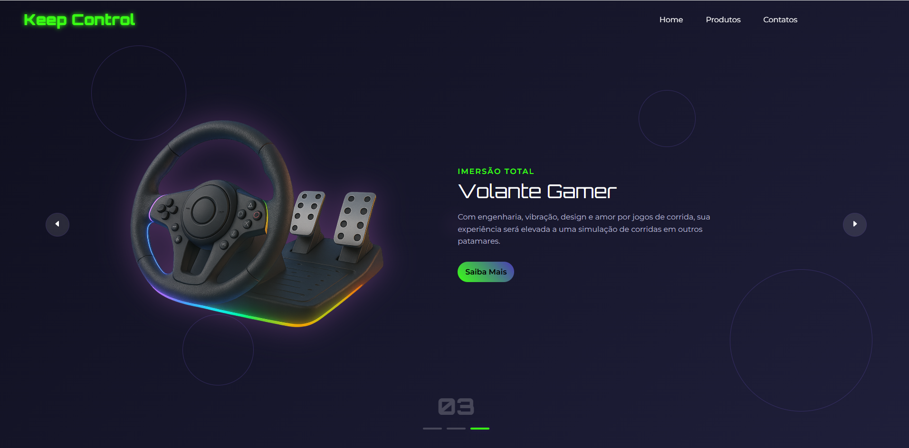

## 🚀 Descrição do Projeto
Este é um site no estilo landing page com visual futurista, criado com HTML, CSS e JavaScript, ideal para apresentar produtos, ideias ou serviços de uma forma moderna e impactante.

## 🛠️ Tecnologias utilizadas:

    HTML para estruturar o conteúdo da página;  
    CSS para o design visual, incluindo efeitos, cores neon e responsividade;  
    JavaScript para a interatividade — botões funcionais, transições suaves, animações e troca de conteúdo.  

 

## 💎 Destaques: 

🌟Design com <strong>estética futurista</strong>, usando brilhos, cores vibrantes e fontes tecnológicas;

🌟Layout <strong>responsivo</strong>, que se adapta a diferentes tamanhos de tela (como celular e desktop);

🌟<strong>Animações suaves</strong> que proporcionam uma experiência visual envolvente;

🌟Botões com <strong>efeitos</strong> ao passar o mouse;

🌟Navegação <strong>intuitiva</strong> entre seções com setas e indicadores.

##

